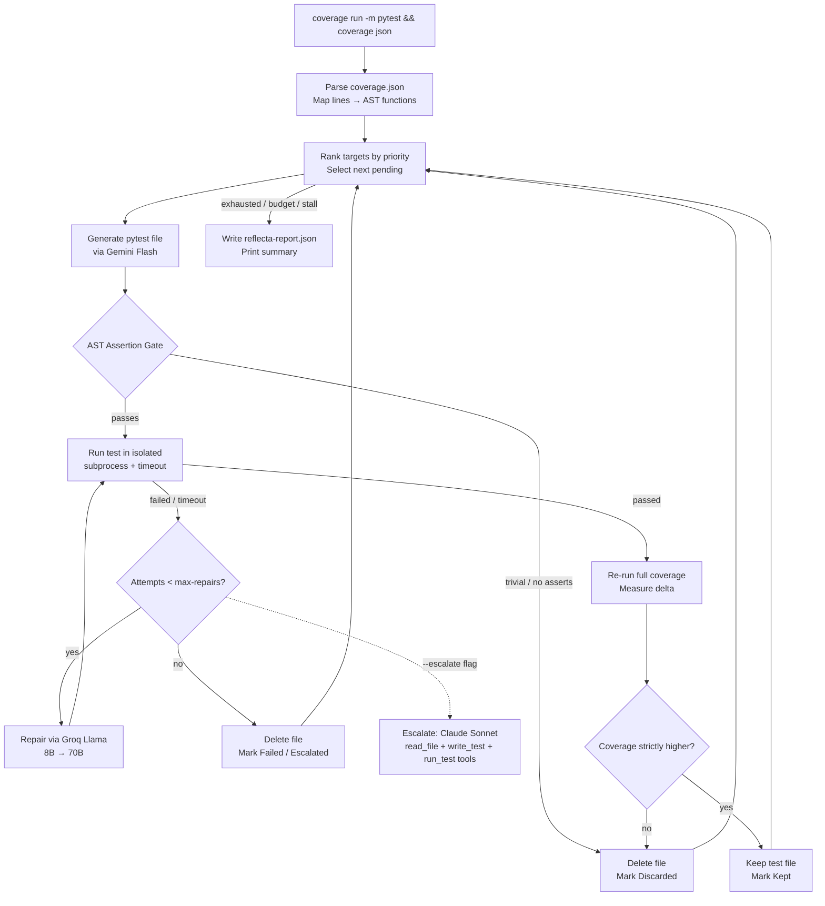

# Reflecta

**Stop writing boilerplate tests. Reflecta finds your coverage gaps, writes targeted pytest tests using free LLM tiers, repairs failures automatically, and keeps only tests that actually move the needle.**

[](https://www.python.org/downloads/)
[](LICENSE)
[](#testing)

---

## What it does

Reflecta is a self-improving test generation pipeline for Python. Point it at any repository, and it:

1. **Measures** real coverage gaps by parsing `coverage.json` and mapping missed lines back to enclosing functions via the source AST.
2. **Generates** targeted pytest files using Gemini Flash — the full source module, existing tests, and exact missed lines all fit in one 1M-token prompt.
3. **Runs** each generated test in an isolated subprocess with a hard timeout; captures tracebacks on failure.
4. **Repairs** failing tests through a Groq Llama repair loop (8B for first attempts, 70B for harder cases) up to a configurable ceiling.
5. **Gates** every kept test on two strict checks: real AST-verified assertions + a strictly positive coverage delta.
6. **Reports** before/after coverage, counts of kept/discarded/repaired tests, and a machine-readable JSON report.

The result: new, passing pytest files in your repo that you didn't have to write, backed by a coverage signal that proves they're not theater.

---

## Why this is hard (the interesting engineering)

Automated test generation is an easy idea with several subtle failure modes that Reflecta has to address explicitly:

| Challenge | What goes wrong without it | Reflecta's solution |
|-----------|---------------------------|---------------------|
| **Coverage theater** | LLMs produce tests that pass but only import the module — coverage goes up trivially without exercising behavior | Coverage-delta gate: re-measure after every passing test; discard if total coverage didn't strictly rise |
| **Trivial assertions** | `assert True`, `assert result is not None`, `assert 1 == 1` — all pass, none catch bugs | AST assertion gate: parse the generated test before running it; reject if every assertion is a literal constant or trivially-true expression |
| **Rate-limited free tiers** | A single 429 from Gemini or Groq mid-run crashes the pipeline and wastes all prior work | Provider wrapper with exponential backoff + `BudgetExhausted` exception; budget tracker stops cleanly before the daily cap |
| **Hanging generated tests** | An LLM might write a test that enters an infinite loop or blocks on stdin | Subprocess execution with per-test timeout; timeout is captured as a traceback and routed to the repair loop |
| **Import-side-effect corruption** | Running a bad generated test in-process can corrupt global state or leave stale coverage data | Subprocess isolation + temp-directory copy of the test tree; the orchestrator's state is never touched |
| **Non-trivial import paths** | Class methods, nested modules, and packages-with-`__init__` all require different `import` strategies | AST-based line→function mapping; prompts include the exact module path and qualified name |
| **Infinite repair loops** | Without a ceiling, a hard-to-fix test causes unbounded LLM spend | 2-failure rule: `--max-repairs` (default 2) caps attempts per target; exhausted targets are marked `failed`, not retried |

---

## Architecture: deterministic orchestrator, not an LLM agent

The main loop is deterministic Python — coverage parsing, target ranking, file I/O, and stop conditions are all code, not LLM decisions. LLMs are invoked only for two tasks: drafting a test (Gemini) and repairing a failing one (Groq). This keeps the pipeline free-tier-friendly, auditable, and debuggable.



---

## Multi-model routing

Each step is routed to the model best suited for it — balancing context window, speed, and free-tier limits:

| Pipeline step | Model | Rationale |
|--------------|-------|-----------|
| Loop orchestration, file I/O, coverage parsing | Deterministic Python | Free, debuggable, no rate-limit exposure |
| Test generation from full source | **Gemini 2.5 Flash** (`google-genai`) | ~1M-token context holds a full module + existing tests in one prompt |
| First repair attempt | **Groq Llama 3.1 8B Instant** (`groq`) | Fast, low-latency for structured traceback → patch tasks |
| Harder repair attempts | **Groq Llama 3.3 70B** (`groq`) | More capable model for complex mock/import failures |
| Stuck targets after N repairs | **Claude Sonnet 4.6** (`anthropic`, opt-in `--escalate`) | Real tool-use loop via Claude subscription; reserved for genuinely hard cases |

---

## The two gates — what keeps Reflecta honest

> **Every test Reflecta keeps must clear both gates. Passing one is not enough.**

**Gate 1 — AST Assertion Validator** ([`src/reflecta/gates.py`](src/reflecta/gates.py))
Parses the generated file's Abstract Syntax Tree before running it. Rejects immediately if:
- Zero `assert` statements present
- Every assertion is a literal constant (`assert True`, `assert 1 == 1`)
- Every assertion compares a literal to itself (`assert "foo" == "foo"`)

**Gate 2 — Coverage-Delta Check** ([`src/reflecta/gates.py`](src/reflecta/gates.py))
After a test passes, re-runs `coverage json` and compares totals. Discards and deletes the test file if total project coverage did not strictly increase. A passing test that only imports the module gets caught here.

---

## Setup

### Prerequisites
- Python 3.11+
- [uv](https://github.com/astral-sh/uv) (recommended) or `pip`
- A free [Google AI Studio](https://aistudio.google.com/) key (Gemini Flash)
- A free [Groq](https://console.groq.com/) key (Llama 3.1/3.3)

### Install

```bash
git clone https://github.com/parthiv-2006/Reflecta-Ai-Agent.git
cd Reflecta-Ai-Agent

# Recommended: uv creates and manages the virtualenv automatically
uv sync

# Or with pip
pip install -e .[dev]
```

### Configure API keys

```bash
cp .env.example .env
# Edit .env and fill in:
# GEMINI_API_KEY=your_key_here
# GROQ_API_KEY=your_key_here
```

Both keys are free-tier. No credit card required to get started.

---

## Usage

Reflecta ships with a pre-built sample project at [`examples/sample_project/`](examples/sample_project/) so you can run it immediately without pointing it at your own code.

### Run against the sample project

```bash
python -m reflecta run --path examples/sample_project --max-iters 3
```

Expected output:
```
Coverage: 64.0% → 92.5%  (+28.5 pp)
Tests kept: 2 | discarded: 1 | repairs: 1
Stop reason: exhausted
Report written to examples/sample_project/reflecta-report.json
```

### Run against your own project

```bash
python -m reflecta run --path /path/to/your/repo --target-coverage 85
```

Generated tests are written to `tests/_reflecta/` inside the target repo. Human-written test files are **never touched**.

### All `run` options

| Flag | Default | Description |
|------|---------|-------------|
| `--path` | required | Path to the Python repository to improve |
| `--max-iters` | `10` | Maximum targets to attempt in one run |
| `--max-repairs` | `2` | Repair attempts before a target is marked `failed` |
| `--max-llm-calls` | `50` | Hard cap on total LLM calls (free-tier safety) |
| `--target-coverage` | unset | Stop once total coverage reaches this % |
| `--stall-k` | `3` | Stop after K consecutive targets that don't raise coverage |
| `--verbose` / `-v` | off | Log each decision to stderr (selected, repaired, kept/discarded) |
| `--escalate` | off | After Groq repair exhausts, escalate to Claude Sonnet with real tools (requires `ANTHROPIC_API_KEY`) |
| `--max-claude-iters` | `3` | Maximum Claude tool-use iterations per escalated target |

### View the last run report

```bash
python -m reflecta report --path examples/sample_project --last
```

### Clean up generated tests

```bash
python -m reflecta clean --path examples/sample_project
```

Only removes files under `tests/_reflecta/`. Human-written tests are untouched.

---

## Stop conditions

The run halts cleanly — always writing a report — when any of these fire:

| Condition | `stop_reason` |
|-----------|--------------|
| All pending targets exhausted | `exhausted` |
| `--max-iters` reached | `max_iters` |
| `--target-coverage` reached | `target_coverage` |
| K consecutive targets with no coverage gain | `stall_k` |
| LLM provider signals rate-limit past retry ceiling | `budget` |
| No uncovered targets found at all | `no_targets` |

---

## Repository structure

```
src/reflecta/
├── models.py          # Canonical dataclasses: CoverageTarget, GeneratedTest, RepairAttempt, RunReport
├── config.py          # .env loading + API-key preflight (clear error on missing keys)
├── cli.py             # Typer CLI: run / clean / report
├── loop.py            # Main orchestration loop (deterministic Python)
├── coverage_report.py # coverage.json → CoverageTarget list via source AST
├── selection.py       # Priority ranking: most-missed lines + simpler signatures first
├── generate.py        # Gemini test generation + _reflecta file writer
├── runner.py          # Subprocess execution + timeout + API-key scrub from env
├── repair.py          # Groq repair loop (8B → 70B escalation)
├── escalate.py        # Claude Sonnet tool-use loop for targets repair can't fix (opt-in)
├── gates.py           # AST assertion gate + coverage-delta gate
├── budget.py          # BudgetTracker: stop before daily cap
├── report.py          # write/read reflecta-report.json
├── prompts.py         # Prompt templates (no logic)
└── llm/
    ├── provider.py    # Retry wrapper + BudgetExhausted (all LLM calls go here)
    ├── gemini.py      # Gemini Flash client
    └── groq.py        # Groq client
```

---

## Testing

The project has 145 unit and integration tests covering every module. Tests are written test-first, matching the same standard Reflecta enforces on generated tests.

```bash
# Run all tests
pytest

# With coverage report
coverage run -m pytest && coverage json -o coverage.json

# Lint + format check
ruff check . && ruff format --check .
```

Live tests (requiring real API keys) are marked `@pytest.mark.live` and excluded from the default run.

---

## Safety guarantees

- **No human test files are ever modified.** Generated tests go only to `tests/_reflecta/`. This is enforced by a hard path check, not convention.
- **API keys never appear in logs or reports.** The subprocess runner scrubs `*_API_KEY` from the child environment before running generated tests.
- **Only run against your own code.** The free Gemini tier may train on inputs; do not point Reflecta at third-party repositories.

---

## v2 Roadmap

- **Claude Agent SDK escalation** ✅ — When Groq fails to repair a test after max attempts, pass `--escalate` to hand the target to Claude Sonnet 4.6, which has `read_file`, `write_test`, and `run_test` tools and runs a bounded iterative loop (hard 55-second timeout per round-trip, no retries). Requires `ANTHROPIC_API_KEY`. Install the optional dep with `pip install reflecta[escalation]`.
- **Mutation testing** — Replace line-coverage delta with a mutation score to catch tests that cover lines but don't actually verify behavior.
- **Branch-coverage targeting** — Parse missing branch nodes from `coverage json` to target specific code paths, not just uncovered lines.
- **CI/CD integration** — Run as a GitHub Action; open a pull request with accepted tests automatically.
- **Parallel targets** — Process independent targets concurrently via git worktrees.
- **`reflecta.toml` config** — Project-level defaults so `--max-iters`, `--target-coverage`, etc. don't need to be repeated on every run.

---

## License

MIT — see [LICENSE](LICENSE).

Built by [Parthiv Paul](https://github.com/parthiv-2006).
