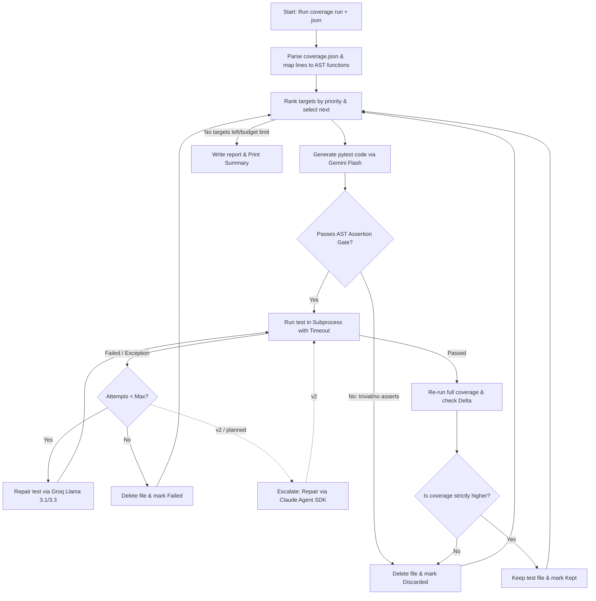

# Reflecta: Automated Pytest Coverage Generator

Reflecta uses LLMs to find untested Python code, write targeted pytest tests, run them, and repair them if they fail. It keeps tests only if they increase the project's coverage score and pass strict assertion checks.

## Key Design Choices

* **Model Routing for Free Tiers:** Rather than running everything on one model, the orchestrator divides tasks based on token and rate limits. Gemini Flash writes the initial test drafts using the full source file and Groq Llama 3 handles triage and iterative code repairs. A Claude (Claude Agent SDK) escalation path for difficult, stuck targets is planned for v2; in v1 a target that exhausts its repair attempts is marked `failed`.
* **AST Quality Gates:** To prevent useless tests (such as assertions that check `assert True`), the codebase parses the generated test's Abstract Syntax Tree. Tests with trivial or missing assertions are deleted.
* **Coverage Delta Checks:** Reflecta runs coverage tools before and after writing tests. If total project coverage does not rise, the test file is discarded.
* **Process Isolation:** Tests run in subprocesses with strict timeouts. If a generated test hangs or loops infinitely, the runner terminates it and passes the timeout traceback back to the repair loop.

---

## Orchestration Loop

Reflecta uses a deterministic orchestrator rather than an LLM agent to control the main loop. The program parses raw coverage data, invokes models for test generation (Gemini) and first-line repairs (Groq), and cleans up the workspace based on test runner outcomes. Escalating hard failures to an agentic subagent (Claude) is a planned v2 path; in v1 the orchestrator marks a stuck target `failed` once its Groq repair attempts are exhausted.



---

## Technical Implementation

### Multi-Model API Routing
The orchestrator divides labor between three models to optimize cost, speed, and accuracy:
* **Gemini Flash (google-genai):** Used for test drafting. The prompt includes the full source module and existing tests, which fits well within Gemini's 1M-token context window.
* **Groq Llama 3.1 8B / 3.3 70B (groq):** Used for fast triage and code repairs. The inputs are small (typically tracebacks or single failing test functions) so they run on Groq to prioritize speed and stay under request-per-minute limits.
* **Claude (claude-agent-sdk) — planned for v2:** The intended escalation path. When Groq fails to repair a test after the maximum number of attempts, v2 will spawn a Claude Agent SDK subagent equipped with file-editing and bash execution tools to resolve complex setups and mock dependencies without consuming pay-as-you-go API credits. In v1 the target is simply marked `failed` at this point.

### Quality Control
Automatic test generation can easily lead to "coverage theater" (passing tests that do not check behavior). Reflecta blocks this with two validators:
1. **AST Assertion Validator:** Parses the Abstract Syntax Tree of the generated file in [gates.py](file:///c:/Users/Parthiv%20Paul/Documents/Reflecta-Ai-Agent/src/reflecta/gates.py). Tests are immediately rejected if they have zero assertions or if all assertions are trivial (such as `assert True`, `assert 1 == 1`, or `assert "foo" == "foo"`).
2. **Coverage-Delta Check:** After a generated test runs and passes, the orchestrator runs the project's coverage tool again. If the total coverage percentage did not rise, the test is deleted and its target is marked as discarded.

### Safety and Rate Limits
* **Subprocess Execution:** Generated tests execute in separate subprocesses managed in [runner.py](file:///c:/Users/Parthiv%20Paul/Documents/Reflecta-Ai-Agent/src/reflecta/runner.py). This protects the orchestrator's state.
* **Timeouts:** Subprocesses are killed after 30 seconds to catch infinite loops or hanging tests. The timeout exception is captured and treated as a test failure for the repair loop.
* **Backoff and Budgeting:** The wrapper in [provider.py](file:///c:/Users/Parthiv%20Paul/Documents/Reflecta-Ai-Agent/src/reflecta/llm/provider.py) retries on API 429 errors using exponential backoff. A budget tracker in [budget.py](file:///c:/Users/Parthiv%20Paul/Documents/Reflecta-Ai-Agent/src/reflecta/budget.py) limits the total API calls in a single run to prevent account lockout.

---

## Repository Structure

The code is organized into decoupled, single-responsibility modules:

* [models.py](file:///c:/Users/Parthiv%20Paul/Documents/Reflecta-Ai-Agent/src/reflecta/models.py): Canonical schemas and dataclasses like `CoverageTarget`, `GeneratedTest`, and `RunReport`.
* [config.py](file:///c:/Users/Parthiv%20Paul/Documents/Reflecta-Ai-Agent/src/reflecta/config.py): Loads `.env` and preflights the required API keys with a clear error.
* [loop.py](file:///c:/Users/Parthiv%20Paul/Documents/Reflecta-Ai-Agent/src/reflecta/loop.py): Main orchestration logic.
* [coverage_report.py](file:///c:/Users/Parthiv%20Paul/Documents/Reflecta-Ai-Agent/src/reflecta/coverage_report.py): Maps missed lines from `coverage.json` to enclosing function nodes using the source AST.
* [selection.py](file:///c:/Users/Parthiv%20Paul/Documents/Reflecta-Ai-Agent/src/reflecta/selection.py): Priority queue logic that ranks targets based on missed line counts and function signature complexity.
* [gates.py](file:///c:/Users/Parthiv%20Paul/Documents/Reflecta-Ai-Agent/src/reflecta/gates.py): AST assertion validation and coverage delta checks.
* [runner.py](file:///c:/Users/Parthiv%20Paul/Documents/Reflecta-Ai-Agent/src/reflecta/runner.py): Handles subprocess test execution and timeout management.
* [repair.py](file:///c:/Users/Parthiv%20Paul/Documents/Reflecta-Ai-Agent/src/reflecta/repair.py): The loop that parses test tracebacks and requests fixes via Groq Llama.
* [cli.py](file:///c:/Users/Parthiv%20Paul/Documents/Reflecta-Ai-Agent/src/reflecta/cli.py): Typer CLI command definitions.

---

## Setup & Installation

### 1. Prerequisites
* Python 3.11+
* [uv](https://github.com/astral-sh/uv) (recommended fast Python package installer) or `pip`

### 2. Clone and Install Dependencies
Install the package in editable mode with development dependencies:

```bash
git clone https://github.com/parthiv-2006/Reflecta-Ai-Agent.git
cd Reflecta-Ai-Agent

# Install using uv (creates a virtual environment automatically)
uv sync

# Or using standard pip
pip install -e .[dev]
```

### 3. Configure Credentials
Create a `.env` file in the root directory:

```bash
cp .env.example .env
```

Open `.env` and fill in your keys (both models offer free tiers):
```env
GEMINI_API_KEY=your_gemini_api_key_here
GROQ_API_KEY=your_groq_api_key_here
```

> **v2 note:** The planned Claude escalation path will use the Claude Agent SDK via local auth (your active Claude Pro or Max subscription) — verify you are logged in to the Claude CLI (Claude Code) once that path ships. v1 needs only the two keys above.

---

## CLI Commands and Usage

Reflecta packages a pre-configured sample project under [examples/sample_project](file:///c:/Users/Parthiv%20Paul/Documents/Reflecta-Ai-Agent/examples/sample_project) to run the tool instantly.

### 1. Run the Suite Against the Sample Project
To run the orchestrator, scan `sample_project`, find untested functions, write/repair tests, and update coverage:

```bash
python -m reflecta run --path examples/sample_project --max-iters 3
```

Example Console Output:
```
Coverage: 64.0% → 92.5%  (+28.5 pp)
Tests kept: 2 | discarded: 1 | repairs: 1
Stop reason: exhausted
Report written to examples/sample_project/reflecta-report.json
```

#### `run` options

| Flag | Default | Purpose |
|------|---------|---------|
| `--max-iters` | `10` | Maximum targets to attempt in one run. |
| `--max-repairs` | `2` | Repair attempts per target before it is marked `failed` (the 2-failure rule). |
| `--max-llm-calls` | `50` | Stop before exceeding this many LLM calls, to stay inside the free-tier daily cap. |
| `--target-coverage` | unset | Stop once total coverage reaches this percent. |
| `--stall-k` | `3` | Stop after this many consecutive targets that do not raise coverage. |
| `--verbose` / `-v` | off | Log each per-target decision (selected, repaired, kept/discarded, stop reason) to stderr. |

The run also stops cleanly with `stop_reason="budget"` if a provider signals it is rate-limited past the retry ceiling — the report is always written.

### 2. View the Last Run Report
To reprint the JSON report from the previous run without querying the APIs again:

```bash
python -m reflecta report --path examples/sample_project --last
```

### 3. Clean Up Generated Tests
To wipe all generated tests under the `_reflecta` subdirectory:

```bash
python -m reflecta clean --path examples/sample_project
```

---

## Testing

Ensure your virtual environment is active, then run pytest to execute the unit and integration tests:

```bash
pytest
```

To run the coverage suite and generate the machine-readable JSON output:

```bash
coverage run -m pytest
coverage json -o coverage.json
```

---

## Roadmap

* **Mutation Testing:** Move beyond line coverage to evaluate test quality using mutation scoring (injecting faults into code to verify if tests fail).
* **Branch-Coverage Target Selection:** Parse missing branch nodes from the coverage output to target specific code paths.
* **CI/CD Integration:** Run as a GitHub Action and automatically submit Pull Requests containing validated, coverage-raising tests.
