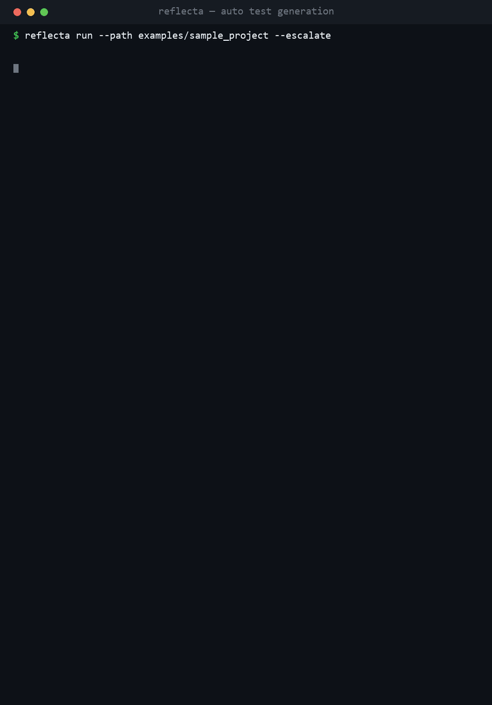
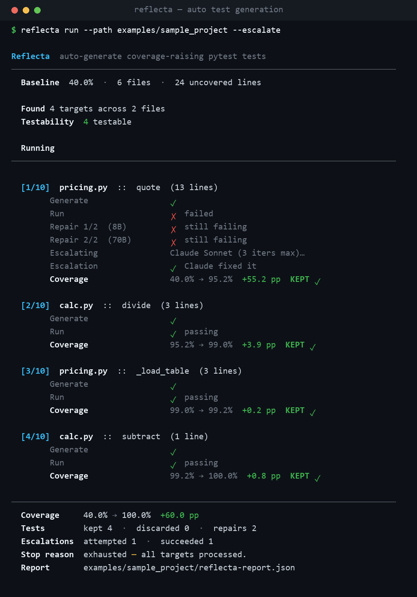
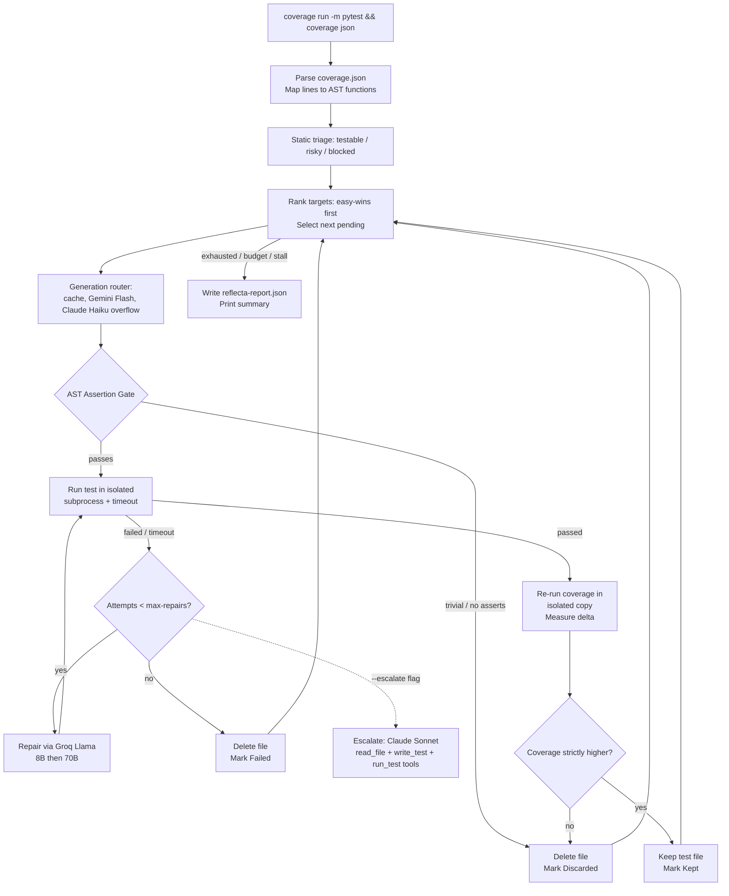
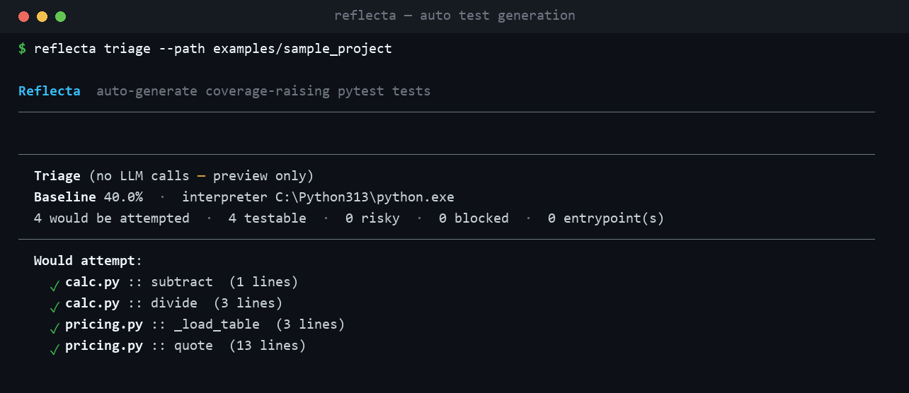

# Reflecta

Reflecta finds coverage gaps in Python repositories, generates targeted pytest tests using free LLM tiers, repairs failures automatically, and keeps only the tests that raise coverage.

[](https://github.com/parthiv-2006/Reflecta-Ai-Agent/actions/workflows/ci.yml)
[](https://www.python.org/downloads/)
[](LICENSE)
[](#testing)

---

## Demo

Run Reflecta against the bundled `examples/sample_project`. It measures the coverage gaps, generates targeted tests, runs the tiered repair chain, and when the free models cannot fix a test, escalates it to Claude Sonnet with real tool use. Coverage goes from 40% to 100% in one run.



The hard target is `pricing.py::quote`. Its correct totals live in a sibling `rate_table.json` that the generation and Groq repair stages never see, so neither can write a passing test for it. The Claude escalation stage has a `read_file` tool, so it opens the table and gets the test right.



The assets come from a real run, not a mock. `python scripts/capture_demo.py` records the transcript, then `python scripts/render_demo.py --run docs/_demo/run.txt --triage docs/_demo/triage.txt --out docs` renders `docs/demo.{gif,mp4,png}`. The video is at [docs/demo.mp4](docs/demo.mp4).

---

## What it does

Point Reflecta at any Python repository and it:

1. **Measures** real coverage gaps by parsing `coverage.json` and mapping missed lines back to their enclosing functions via the source AST.
2. **Triages** every uncovered target statically (AST only, no LLM) as `testable`, `risky` (direct I/O), or `blocked` (import-side-effect), and skips the un-attemptable ones before spending any quota.
3. **Generates** targeted pytest files through a routing chain: disk cache (SHA-256 key, 7-day TTL, zero quota), then Gemini Flash (1M-token context holds a full module plus existing tests), then Claude Haiku overflow when Gemini's 250 RPD daily cap is hit (capped at 20 calls per run).
4. **Runs** each generated test in an isolated subprocess with a hard timeout, capturing tracebacks on failure.
5. **Repairs** failing tests through a Groq Llama loop (8B first, 70B for harder failures) up to a configurable ceiling. Targets that survive neither pass can be escalated to Claude Sonnet with real tool use (`--escalate`).
6. **Gates** every kept test on two checks: real AST-verified assertions, and a strictly positive coverage delta. With `--mutation`, an optional third gate verifies that the test would actually fail if the code were wrong.
7. **Reports** before and after coverage, kept/discarded/repaired counts, the LLM call breakdown by provider, and a machine-readable JSON report.

---

## Architecture

The orchestration loop is plain Python. Coverage parsing, target ranking, file I/O, and stop conditions are code, not model decisions. The models are called for only two jobs: drafting a test and repairing one. This keeps the pipeline cheap on free tiers, auditable, and debuggable.



### Model routing

| Pipeline step | Model | Why |
|--------------|-------|-----------|
| Loop orchestration, coverage parsing, file I/O | Deterministic Python | Free, debuggable, no rate-limit exposure |
| Generation (cache hit) | Disk cache (SHA-256, 7-day TTL) | Zero quota; re-runs of the same repo cost nothing |
| Test generation (cache miss) | Gemini 2.5 Flash (`google-genai`) | ~1M-token context holds a full module plus existing tests in one prompt |
| Generation overflow (Gemini RPD=250 exhausted) | Claude Haiku 4.5 (`anthropic`, capped 20 calls/run) | Activates automatically; same `ANTHROPIC_API_KEY` as escalation |
| First repair attempt | Groq Llama 3.1 8B Instant (`groq`) | Fast and low-latency for traceback-to-patch tasks |
| Harder repair attempts | Groq Llama 3.3 70B (`groq`) | More capable on complex mock and import failures |
| Stuck targets after N repairs | Claude Sonnet 4.6 (`anthropic`, opt-in `--escalate`) | Real tool-use loop, reserved for the genuinely hard cases |

---

## The gates

Every kept test must clear gates 1 and 2. Gate 3 is an optional, zero-quota check that runs only after the first two pass.

**Gate 1: AST assertion validator** ([`src/reflecta/gates.py`](src/reflecta/gates.py))

Parses the generated file's AST before running it. Rejects immediately if:
- there are zero `assert` statements,
- every assertion is a literal constant (`assert True`, `assert 1 == 1`), or
- every assertion compares a literal to itself (`assert "foo" == "foo"`).

**Gate 2: coverage-delta check** ([`src/reflecta/gates.py`](src/reflecta/gates.py))

After a test passes, re-runs `coverage json` and compares totals. The test file is discarded and deleted if total project coverage did not strictly increase. A passing test that only imports the module is caught here.

**Gate 3: mutation score (optional, `--mutation`)** ([`src/reflecta/mutation.py`](src/reflecta/mutation.py), [`src/reflecta/gates.py`](src/reflecta/gates.py))

Line coverage proves a test executed the code. It does not prove the test would fail if the code were wrong. Gate 3 plants single-operator mutants inside the target function's line span: arithmetic op swaps (`+`/`-`, `*`/`/`), comparison swaps (`<`/`>=`, `==`/`!=`), boolean op swaps (`and`/`or`), `not` removal, and constant tweaks (`n` to `n+1`, `True`/`False`). Each mutant is produced by transforming one AST node and re-rendering with `ast.unparse`; no-op mutants (text identical to the original) are dropped. The test is re-run against each mutant in an isolated temp copy of the repo, and a mutant is killed if the test now fails. The test is kept only if `killed / total >= --min-mutation-score` (default `0.5`). A function with no mutable surface scores 1.0 and always passes.

Cost is bounded to `(kept candidates x --max-mutants)` subprocess runs. No provider calls, no LLM quota, and the real working tree is never modified.

---

## Setup

### Prerequisites
- Python 3.11+
- [uv](https://github.com/astral-sh/uv) (recommended) or `pip`
- A free [Google AI Studio](https://aistudio.google.com/) key (Gemini Flash)
- A free [Groq](https://console.groq.com/) key (Llama 3.1/3.3)

### Install

```bash
git clone https://github.com/parthiv-2006/Reflecta-Ai-Agent.git
cd Reflecta-Ai-Agent

# Recommended: uv creates and manages the virtualenv automatically
uv sync

# Or with pip
pip install -e .[dev]
```

### Configure API keys

```bash
cp .env.example .env
# Edit .env and fill in:
# GEMINI_API_KEY=your_key_here
# GROQ_API_KEY=your_key_here
```

Both keys are free-tier. No credit card is required to get started.

### Remote mode (run on someone else's keys)

Reflecta can run as a hosted product where users do not need their own keys. A [proxy](proxy/) you operate holds the provider keys and meters usage per token, while the user's code runs entirely on their own machine.

```bash
reflecta login              # paste a token issued by the operator
reflecta run --path . -v    # no GEMINI/GROQ keys needed
reflecta logout             # remove stored credentials
```

When a reflecta token is configured it takes precedence over local provider keys. See [`docs/REMOTE-MODE.md`](docs/REMOTE-MODE.md) and [`proxy/README.md`](proxy/README.md).

---

## Usage

Reflecta ships with a pre-built sample project at [`examples/sample_project/`](examples/sample_project/) so you can run it immediately.

### Full walkthrough on your own repo

This exercises every feature in order. Run it from anywhere and point `--path` at the repo you want to improve. Use your own repo: the free Gemini tier may train on its inputs.

```bash
# 1. Install Reflecta (its own venv; it runs the target repo under the TARGET's venv)
pipx install reflecta            # or: pip install reflecta

# 2. Two free keys, from aistudio.google.com and console.groq.com
export GEMINI_API_KEY=...        # test generation
export GROQ_API_KEY=...          # test repair
#   (optional) export ANTHROPIC_API_KEY=...   # enables --escalate and Haiku overflow

cd /path/to/your/repo            # a repo with a pytest suite

# 3. PREVIEW (zero quota, no LLM): what would Reflecta attempt vs skip, and why?
reflecta triage --path .

# 4. RUN with every gate on: generate, run, repair, and keep only tests that
#    raise coverage AND survive the mutation gate.
reflecta run --path . --mutation --target-coverage 85 -v

#    Writes tests to tests/_reflecta/, prints a before/after summary, and saves
#    reflecta-report.json. Re-read it any time:
reflecta report --path . --last

# 5. OPEN A PR with the accepted tests (needs GITHUB_TOKEN with pull-requests:write).
#    Preview the exact PR first (no git, no network, no token needed):
reflecta ci --path . --mutation --dry-run
export GITHUB_TOKEN=...          # GitHub Actions injects this automatically
reflecta ci --path . --mutation

# 6. Undo: remove everything Reflecta generated (human tests are never touched)
reflecta clean --path .
```

To avoid repeating flags, drop a [`reflecta.toml`](examples/reflecta.toml) at the repo root (`[tool.reflecta]` with `mutation = true`, `target_coverage = 85`, and so on); both `run` and `ci` read it, and CLI flags still override. To run it on a schedule, copy [`examples/reflecta-ci.yml`](examples/reflecta-ci.yml) into `.github/workflows/`.

No keys? Every command above has a preview or offline path: `triage` and `run --dry-run` spend zero quota, and `ci --dry-run` shows the PR without a token.

### Run against the sample project

```bash
python -m reflecta run --path examples/sample_project --escalate
```

`subtract`, `divide`, and `_load_table` are one-shot Gemini keeps. `pricing.py::quote` fails its draft, survives neither Groq repair pass, and is recovered by the Claude escalation stage. Expected summary:

```
Coverage     40.0% -> 100.0%  +60.0 pp
Tests        kept 4  .  discarded 0  .  repairs 2
Escalations  attempted 1  .  succeeded 1
Stop reason  exhausted (all targets processed)
```

Drop `--escalate` and the run still reaches 100%, because `quote`'s passing sub-tests are salvaged instead. Escalation is what recovers the whole generated file when the free tiers cannot, by reading the sibling `rate_table.json` that the earlier stages never see.

### Run against your own project

```bash
python -m reflecta run --path /path/to/your/repo --target-coverage 85
```

Generated tests are written to `tests/_reflecta/` inside the target repo. Human-written test files are never touched.

### All `run` options

| Flag | Default | Description |
|------|---------|-------------|
| `--path` | required | Path to the Python repository to improve |
| `--max-iters` | `20` | Maximum targets to attempt in one run |
| `--max-repairs` | `2` | Repair attempts before a target is marked `failed` |
| `--max-llm-calls` | `50` | Hard cap on total LLM calls (free-tier safety) |
| `--target-coverage` | unset | Stop once total coverage reaches this percent |
| `--stall-k` | `7` | Stop after K consecutive targets that don't raise coverage |
| `--verbose` / `-v` | off | Log each decision to stderr (selected, repaired, kept/discarded) |
| `--escalate` | off | After Groq repair exhausts, escalate to Claude Sonnet with real tools (requires `ANTHROPIC_API_KEY`) |
| `--max-claude-iters` | `3` | Maximum Claude tool-use iterations per escalated target |
| `--python` | auto | Interpreter for running generated tests. Auto-detects the target repo's `.venv`/`venv`/`env`, then falls back to Reflecta's own interpreter |
| `--skip-entrypoints` / `--no-skip-entrypoints` | on | Skip `main` and functions under `if __name__ == "__main__"`, which are not unit-testable. Use `--no-skip-entrypoints` to attempt them anyway |
| `--attempt-risky` | off | Also attempt risky targets (functions that directly call network/DB/browser/subprocess APIs). Off by default, since the free models rarely repair these |
| `--mutation` | off | Enable the mutation gate: discard kept tests whose mutation score is below `--min-mutation-score`. Zero LLM quota |
| `--min-mutation-score` | `0.5` | Minimum fraction of mutants a test must kill to pass gate 3 (range 0.0 to 1.0) |
| `--max-mutants` | `30` | Maximum mutants to generate and test per kept candidate |
| `--dry-run` | off | Preview what would be attempted vs skipped (static triage plus import preflight) without calling any LLM |
| `--cache-dir` | auto | Override the generation cache directory (default: `{repo}/.reflecta/gen_cache/`) |

### Preview with zero quota spend

Some functions can never yield a kept test no matter what the model writes. A module that needs live credentials at import cannot even be collected, and a function whose entire body is a network call needs mocking that the free models reliably fail at. Reflecta classifies every target statically (AST only, no LLM) as `testable`, `risky`, or `blocked` before spending any quota.

```bash
python -m reflecta triage --path /path/to/repo
# or equivalently:
python -m reflecta run --path /path/to/repo --dry-run
```

You get a per-target breakdown: what would be attempted, what would be skipped, and why (`directly performs network I/O`, `module reads credentials at import`, and so on). A function that receives its client as a parameter (dependency injection) is classified as testable. Use `--attempt-risky` to force the risky tier.



### Repos with their own dependencies

Reflecta runs generated tests under the target repo's interpreter so its imports resolve. It auto-detects `.venv`/`venv`/`env` inside the repo root. If dependencies live elsewhere:

```bash
python -m reflecta run --path /path/to/repo --python /path/to/repo/.venv/bin/python
# Windows: --python C:\path\to\repo\.venv\Scripts\python.exe
```

Before the loop, Reflecta preflights the targets' third-party imports and reports any that are missing, so you see exactly what to install instead of every target failing silently.

Reflecta also verifies that `coverage` and `pytest` exist inside the target environment, since they must run there and not in Reflecta's own venv. If either is missing, it is pip-installed into the detected target venv automatically (with a warning). If that is impossible the run stops with the exact install command instead of silently reporting a 0.0% baseline.

### Troubleshooting

| Symptom | What it means | Fix |
|---------|---------------|-----|
| `LLM quota / rate limit hit`, `Stop reason: budget` | Gemini/Groq free-tier 429. The message names the provider, echoes the raw API text, and distinguishes per-minute from daily caps | Wait ~60s (per-minute) or until daily reset and re-run with a smaller `--max-iters`, or use a paid key |
| `request too large for model TPM` during repair | The repair prompt exceeded the model's free-tier tokens-per-minute budget (HTTP 413). Reflecta auto-trims and escalates 8B to 70B | Usually self-resolves. If it persists the target is marked `failed` and the run continues |
| `target needs '<pkg>', which is not installed` | The target's dependency is not importable under the interpreter in use | Install it in that environment, or pass `--python <venv-python>` |
| `The target environment is missing coverage/pytest` | The target venv lacks the measurement tooling and auto-install failed (offline or read-only env) | Run the printed `pip install` command inside the target venv |
| `Coverage measurement produced no report` | The coverage run itself crashed under the target interpreter (the captured stderr tail is shown) | Check the printed error, usually a broken venv or unrunnable conftest |
| Targets reported `skipped` | Entrypoints skipped by default, or drafts that failed both generation and regeneration | Expected. Use `--no-skip-entrypoints` to attempt `main`-style functions |

### Other commands

```bash
# Reprint the last run report without re-running
python -m reflecta report --path examples/sample_project --last

# Remove all generated tests (human-written tests untouched)
python -m reflecta clean --path examples/sample_project

# Store/remove remote mode credentials
reflecta login --token <token>
reflecta logout
```

---

## CI mode: open a pull request with the accepted tests

`reflecta ci` runs the same loop as `reflecta run`, then commits the kept tests to a branch and opens (or updates) a pull request describing the run. This lets Reflecta run as a scheduled bot that raises coverage instead of only a local tool.

```bash
# Run the loop and open a PR with the accepted tests
reflecta ci --path .

# Preview the PR it would open (runs the loop but commits/pushes/opens nothing)
reflecta ci --path . --dry-run
```

What it does, and the guarantees around it:

- **Only accepted tests ship.** Every test in the PR has cleared the assertion and coverage-delta gates (and the mutation gate when `--mutation` is on). Nothing is committed unless coverage strictly rose.
- **Human tests are never touched.** Only `tests/_reflecta/` is staged, so a human-written file cannot be swept into the commit (hard rule #1).
- **Idempotent.** A re-run pushes onto the same branch (`reflecta/auto-tests` by default) and updates the existing PR instead of opening a duplicate. If no tests are kept, there is no branch and no PR.
- **The PR body is a review aid** built from the run report: coverage before and after, kept/discarded/repair counts, the aggregate mutation score, and the list of newly covered targets.

Credentials: the loop needs `GEMINI_API_KEY` and `GROQ_API_KEY` as usual; the PR step needs `GITHUB_TOKEN` (with `pull-requests: write`), which is exactly what GitHub Actions injects. `--dry-run` needs no `GITHUB_TOKEN`.

### `reflecta.toml` (so CI stays a one-liner)

Pin per-project defaults once and `reflecta ci --path .` (or `reflecta run --path .`) needs no flags; explicit flags still override the file. Both `run` and `ci` read it, with precedence CLI flag > `reflecta.toml` > built-in default. See [`examples/reflecta.toml`](examples/reflecta.toml).

```toml
[tool.reflecta]
max_iters = 25
mutation = true
min_mutation_score = 0.5
base_branch = "main"
head_branch = "reflecta/auto-tests"
```

### GitHub Action

Copy [`examples/reflecta-ci.yml`](examples/reflecta-ci.yml) to `.github/workflows/reflecta.yml`, add `GEMINI_API_KEY` and `GROQ_API_KEY` as repository secrets, and Reflecta will open a coverage PR on a weekly schedule (or on demand via Run workflow).

---

## Stop conditions

The run always writes a report before halting. It stops when any of these fire:

| Condition | `stop_reason` |
|-----------|--------------|
| All pending targets exhausted | `exhausted` |
| `--max-iters` reached | `max_iters` |
| `--target-coverage` reached | `target_reached` |
| K consecutive targets with no coverage gain | `stalled` |
| LLM provider rate-limited past retry ceiling | `budget` |
| No uncovered targets found | `no_targets` |
| Every target classified blocked/risky and `--attempt-risky` not set | `no_testable_targets` |

---

## Repository structure

```
src/reflecta/
├── models.py          # Canonical dataclasses: CoverageTarget, GeneratedTest, RepairAttempt, RunReport
├── config.py          # .env loading + API-key preflight
├── cli.py             # Typer CLI: run / ci / triage / clean / report / login / logout
├── loop.py            # Main orchestration loop (deterministic Python)
├── ci.py              # reflecta ci: wrap run_loop, open a PR of accepted tests
├── git_ops.py         # Subprocess git wrapper (branch/stage/commit/push)
├── forge.py           # GitHub PR host over httpx (PullRequestHost protocol)
├── settings.py        # reflecta.toml loader (run/ci defaults; CLI overrides)
├── coverage_report.py # coverage.json to CoverageTarget list via source AST
├── selection.py       # Priority ranking: easy wins (<=15 lines) first, then by missed-line count
├── testability.py     # Static AST triage: testable / risky / blocked (no LLM, no execution)
├── generate.py        # Test generation + validation/regeneration + _reflecta file writer
├── validation.py      # Reject empty/no-test/missing-import drafts before entering repair
├── environment.py     # Target venv auto-detect + third-party import preflight
├── runner.py          # Subprocess execution + timeout + API-key scrub from env
├── repair.py          # Groq repair loop (8B then 70B) + prompt size budgeting
├── escalate.py        # Claude Sonnet tool-use loop for targets repair can't fix (opt-in --escalate)
├── gates.py           # AST assertion gate + coverage-delta gate + mutation gate
├── mutation.py        # Mutation gate: AST mutants + kill-score scorer
├── budget.py          # BudgetTracker: stop before daily cap
├── report.py          # write/read reflecta-report.json
├── prompts.py         # Prompt templates (no logic)
└── llm/
    ├── provider.py        # Retry wrapper + BudgetExhausted/RequestTooLarge (all LLM calls go here)
    ├── limits.py          # Free-tier RPM/RPD/TPM/TPD per model + per-prompt token budgeting
    ├── router.py          # generate() chain: cache, Gemini Flash, Claude Haiku overflow
    ├── cache.py           # SHA-256 disk cache for generation results (7-day TTL)
    ├── gemini.py          # Gemini Flash client
    ├── groq.py            # Groq client
    ├── claude_generate.py # Claude Haiku overflow generation (activated when Gemini RPD exhausted)
    └── remote.py          # Remote key-broker mode: route calls through a hosted proxy

eval/                  # Eval harness: fixed fixtures + recordings for quota-free CI measurement
proxy/                 # Standalone FastAPI broker for remote mode (own README + 12 tests)
```

---

## Testing

Every module has tests (the current count is in the badge above), including the mutation gate (`test_mutation.py`) and the CI/PR path (`test_git_ops.py`, `test_forge.py`, `test_ci.py`, `test_settings.py`, `test_cli_ci.py`). They were written test-first, to the same standard Reflecta enforces on generated tests.

```bash
# Run all tests
pytest

# With coverage report
coverage run -m pytest && coverage json -o coverage.json

# Lint + format check
ruff check . && ruff format --check .
```

The eval harness under `eval/` runs against fixed fixtures with committed LLM response recordings, so CI runs are quota-free by default. Live tests (which require real API keys) are marked `@pytest.mark.live` and excluded from the default run.

---

## Safety guarantees

- **No human test files are ever modified.** Generated tests go only to `tests/_reflecta/`, enforced by a hard path check rather than convention.
- **Generated tests never run against your real working tree.** Both validation and coverage-delta measurement execute the generated test inside a disposable copy of the repo under a wall-clock timeout, so a destructive or hanging test cannot corrupt your checkout.
- **API keys never appear in logs or reports.** The subprocess runner scrubs `*_API_KEY` from the child environment before running generated tests.
- **Only run against your own code.** The free Gemini tier may train on its inputs, so do not point Reflecta at third-party repositories.

---

## Roadmap

- **Branch-coverage targeting.** Parse missing branch nodes from `coverage json` to target specific code paths, not just uncovered lines.
- **Parallel targets.** Process independent targets concurrently via git worktrees.
- **Other languages.** JS/Jest, Go.

Mutation testing, CI/PR integration (`reflecta ci`), and `reflecta.toml` config have already shipped; see the gates, CI mode, and `reflecta.toml` sections above.

---

## License

MIT. See [LICENSE](LICENSE).

Built by [Parthiv Paul](https://github.com/parthiv-2006).
